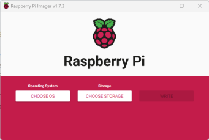
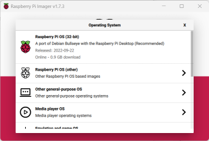
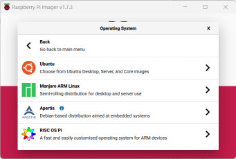

# Install of Raspberry Pi

## Ubuntu server

ROS is only supported on Ubuntu, so we need to install Ubuntu and not
the Raspberry Pi OS.

For the install the Raspberry Pi Imager is used
<https://www.raspberrypi.com/software/>.\

This install is based on [ROS2
Humble](https://docs.ros.org/en/humble/index.html) and [Raspberry Pi \#
model
B+](https://www.raspberrypi.com/products/raspberry-pi-3-model-b-plus/)

1.  Choose Storage

    Check the system requirements of the ROS-distribution you're want to
    use and the version of the Raspberry Pi it will be installed on.

    'Other general-purpose OS' -\> 'Ubuntu' -\> 'Ubuntu Server 22.04.1
    LTS (64-bit)'

    
     

2.  Choose Storage

    Select the SD-card on which the OS must be installed.

3.  Set advanced Options

    -   Set hostname: `my-robot` (or any name you want)

        This will be the name of the robot on the network. If you use
        more robots, make sure the names are unique within your network.

    -   Enable SSH: `check`

        I'm not using a desktop-like interface on the pi (for
        performance reasons), to connect to the pi SSH is used.

        -   Password
            -   Set user: `user-name` ([do not use
                `pi`](https://www.raspberrypi.com/news/raspberry-pi-bullseye-update-april-2022/))
            -   Set password: `*********`
        -   or; authentication key

    -   Configure wireless LAN: `check`

        I'm not using ethernet cables. Using WiFi with ROS is a bit
        tricky and unstable, but I'm trying to solve that. The robot
        must be able to drive around *on it's own*.

        -   SSID: `your wifi ssid`
        -   Password: `******`
        -   Wireless LAN country: `your country`

    - Locale settings

        These will be set during the ROS install and setup.

Hit *Write* to write the image to the SD-card. After the write, put the SD-card in the Raspberry Pi and start it.

# Notes

-   setup rpi without monitor and keyboard

    https://www.instructables.com/How-to-Setup-Raspberry-Pi-Without-Monitor-and-Keyb/

    1.  Maar ik ga ubuntu gebruiken

        https://ubuntu.com/download/raspberry-pi (30-4-2021)

        https://ubuntu.com/tutorials/how-to-install-ubuntu-on-your-raspberry-pi#3-using-advanced-options

        Ubuntu Server 20.04.2 LTS 64 bit

        Determining the Pi's IP address
        <https://ubuntu.com/tutorials/how-to-install-ubuntu-on-your-raspberry-pi#4-boot-ubuntu-server>

        -   Windows

            -   connect ethernet card
            -   share wifi with ethernet card
            -   `arp -a | findstr b8-27-eb` gives ip

    2.  connectie met ssh

        `ssh ubuntu@<ip>`

        On first logon change default password `ubuntu` to your own

    3.  firewall

        1.  `sudo ufw allow ssh`
        2.  `sudo ufw allow in proto udp to 224.0.0.0/4`
        3.  `sudo ufw allow in proto udp from 224.0.0.0/4`
        4.  `sudo ufw allow 7400:7430/tcp`
        5.  `sudo ufw allow 7400:7430/udp`
        6.  `sudo ufw enable`

        stap 2 t/m 5 zijn voor ROS (detectie op netwerk)

    4.  update

        (optioneel)

        -   `sudo dpkg-reconfigure unattended-upgrades` en klik op *no*.
            Anders wordt de unattended-upgrades steeds opgestart bij
            opstarten systeem.
        -   `sudo systemctl stop unattended-upgrades`
        -   `sudo apt remove unattended-upgrades`

        `sudo apt update`

        After `update` the unattended-upgrade is started. Use `top` to
        see when it is finished.

        `sudo apt full-upgrade`

    5.  add to (home) wifi

        1.  `sudo apt install network-manager`
        2.  `sudo nmtui`
        3.  Activate network, follow instructions

-   GPIO (pinnen gebruiken)

    -   installeer `sudo apt install python3-rpi.gpio`
    -   geef de gebruiker rechten op GPIO
        -   groep gpio toevoegen `sudo addgroup gpio`
        -   gebruiker toevoegen `sudo usermod -a -G gpio $USER`

-   blink led (not blinking)

    -   <https://raspberrypihq.com/making-a-led-blink-using-the-raspberry-pi-and-python/>

        Verkeerde board layout (veranderd in ledblink.py)

    -   `sudo apt install wiringpi`

        om handmatig gpio te gebruiken
        (<https://www.teknotut.com/en/first-raspberry-pi-project-blink-led/>)

-   Op windows ook firewall instellen dat Ros er bij kan:

    1.  op windows defender
    2.  inbound rules -\> add new rule
    3.  select `port`
    4.  allow rang `7400-7429` (dat is voor domain id 1)

-   ROS 2 installatie op py

    -   <https://docs.ros.org/en/foxy/Installation/Ubuntu-Install-Debians.html>

-   Verwijder op Windows de python 3.9 installatie, daar heb je alleen
    maar last van

-   windows 10: `pip install rosdistro`

-   /dev/i2c/ is niet te benaderen voor ander gebruikers, doe:

    -   `sudo apt install i2c-tools`
    -   ~`sudo groupadd i2c (group may exist already)`~
    -   \~`sudo chown :i2c /dev/i2c-1` (or i2c-0)\~
    -   ~`sudo chmod g+rw /dev/i2c-1`~
    -   `sudo usermod -aG i2c $USER`
    -   `sudo reboot now` (or logout)
